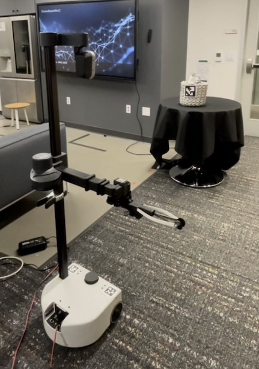
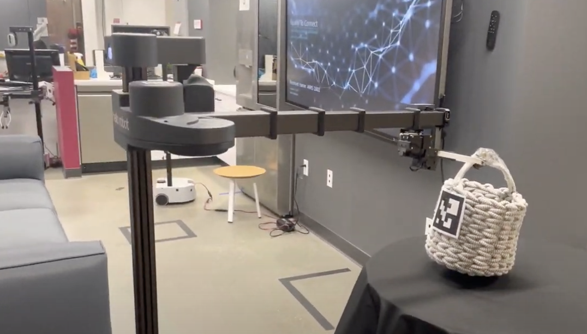
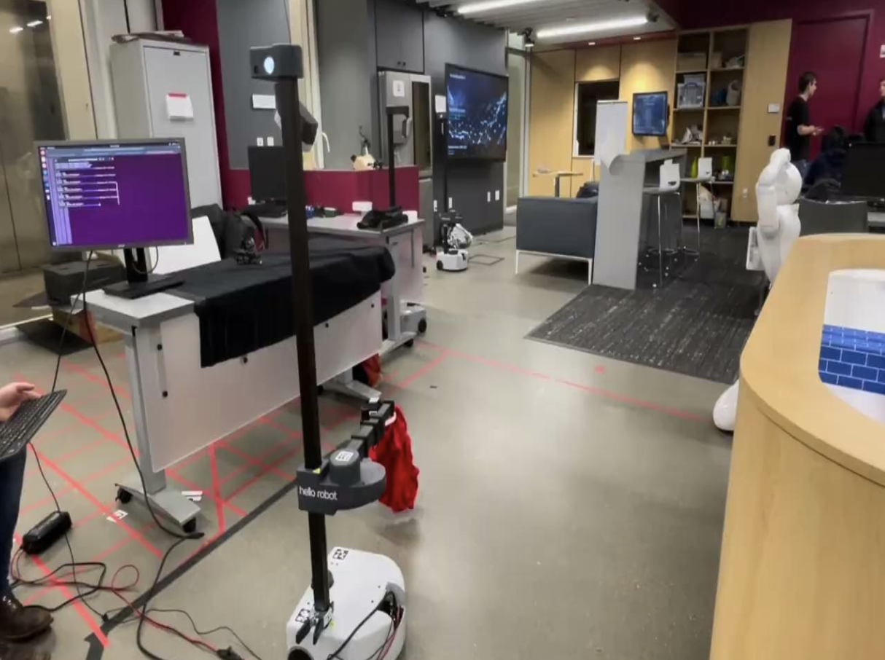

# 16-887: Robotic Caregivers and Intelligent Physical Collaboration (Spring 2023)

## Course Info

#### [Syllabus](https://docs.google.com/document/d/1ErwhtIxKNvjSrdTAOVQERCSbPnF-3080vzTFMskgZW0/edit?usp=sharing)  

#### [Course Schedule](https://docs.google.com/spreadsheets/d/1uwG0DBwU2lGfzsGBvEgk-mQjlq_SGgmwQbAg5PaKan4/edit?usp=sharing)  

#### [Course Project Statement](https://docs.google.com/document/d/1oWTJWTmuLOAim5ofcozVergusDQW6OwHfSeVpY0MVUM/edit?usp=sharing)  

#### [Midterm Presentation Grading Rubric](https://docs.google.com/document/d/1_utDSkDYw1NuT-zqvhW_06ndepuDD5P4vj1WAv0l2UA/edit?usp=sharing)  

#### [Final Presentation Grading Rubric](https://docs.google.com/document/d/1vKpjrNR3gaVmzSd1aw-s67nSS6CUuTJsI-m2cXB_c78/edit?usp=sharing)  

#### [Final Report Grading Rubric](https://docs.google.com/document/d/1O3MVdvi250cAr2j5N8iNtJmIc_ZIyzVk7eIrUE-JPjI/edit?usp=sharing)  

**Time**: Monday & Wednesday 12:30 - 1:50 PM  
**Location**: NSH 3002  
**Instructor**: [Zackory Erickson](https://zackory.com)  
**Office Hours**: Wednesday 1:50 - 2:30 PM  
**Course Questions and Discussion**: Slack -- Registered students will be added

---

## Final Projects

### Food Basket Delivery with the Stretch
[[Presentation PDF]](media/food_delivery.pdf) [[Project Report]](media/16_887_Team_1_Project_Report.pdf)

 &emsp; 

###  CPU: Clothing Picker Upper
[[Presentation PDF]](media/cpu.pdf)

### Stretch RE1 Voice Control
[[Presentation PDF]](media/voice.pdf)

---

## Course Description

Robotics researchers and futurists have long dreamed of robots that can serve as caregivers. In this project-based course, you'll learn about intelligent physical human-robot collaboration and opportunities for robots that contribute to caregiving. You'll gain hands-on experience with teleoperation, autonomy, perception, navigation, manipulation, human-robot interaction, and machine learning. You'll also learn about robot design, collaborative research, and healthcare robotics.

This is a graduate-level project-based course for students interested in physical human-robot collaboration and robotic caregiving. There are no exams nor textbook assignments. You will be working with a group of your peers to develop solutions to real-world problems in which robots physically interact with and assist people. There are two projects where you will work with a **_real mobile manipulator_** and build on state-of-the-art methods from scientific literature, all leading to a live robot demonstration, presentation, and short paper to disseminate your results.

### Pre-Requisites
Prior experience with the Python programming language is encouraged and extremely beneficial. 

## History and Example Projects

This course has been developed and inspired based on a prior project-based course on mobile manipulation for robotic caregiving, taught at CMU and Georgia Tech.

Examples of past robotic caregiving projects can be found on the following course webpage: [16-887: Robotic Caregivers and Intelligent Physical Collaboration (2022)](https://zackory.com/rc2022/)

## Credit

Earlier versions of this course were co-developed and co-instructed with [Prof. Charlie Kemp](https://charliekemp.com) at Georgia Tech. An adaptation of this course, [Robotic Caregivers](https://sites.gatech.edu/robotic-caregivers/), is still taught at Georgia Tech (as of Spring 2023).

